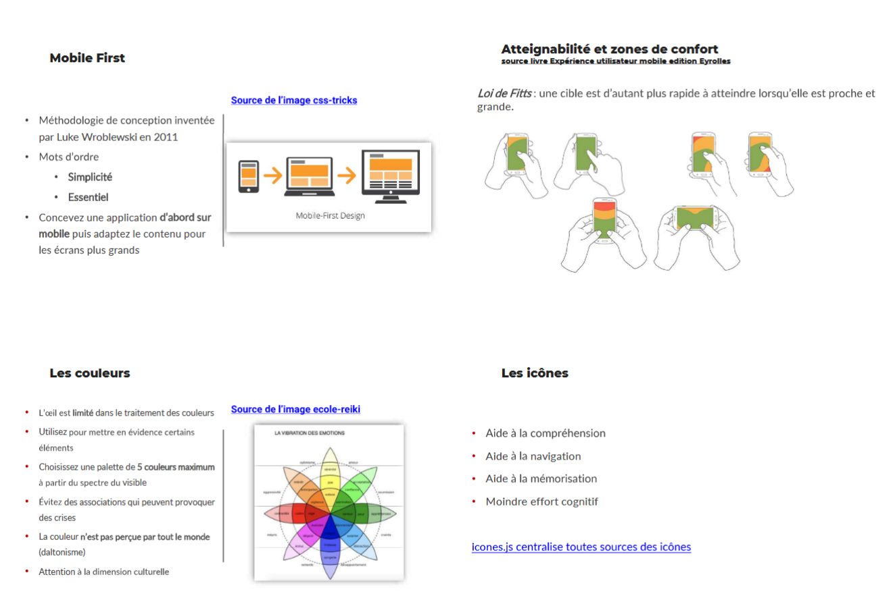

# Mise en situation dev

## Avant de commencer

Le formateur joue à la fois le rôle de client, de Product Owner (responsable produit, fontionnelle), de Tech Lead (référent, aide et support technique) et garant du bon déroulement du projet dans les meilleures conditions.

### Ressources

#### Git & GitHub

- [**Commandes *Git***](https://git-scm.com/cheat-sheet)
- [**Convention commit Angular**](https://www.conventionalcommits.org/en/v1.0.0/)

#### HTML

- [Documentation *HTML*](https://www.w3schools.com/html/html_intro.asp)

#### CSS

- [Documentation *CSS*](https://www.w3schools.com/css/default.asp)
- [**Documentation media queries *CSS***(CSS et mise en page en fonction de la taille de l'écran)](https://www.w3schools.com/css/css_rwd_mediaqueries.asp)

#### JS

- [Documentation *JS*](https://www.w3schools.com/js/default.asp)
- [Documentation stockage côté client(navigateur)](https://www.w3schools.com/html/html5_webstorage.asp)
- [Documentation expression régulière avec *JavaScript*](https://www.w3schools.com/js/js_regexp.asp)

#### PHP

- [Fonctions de hachage des mots de passe avec PHP](https://www.php.net/manual/fr/ref.password.php)

## UX/UI

- Article sur [SPA (Single Page Application)](https://www.mobiskill.fr/blog-posts/quest-ce-quune-single-page-application)
- [Google Fonts](https://fonts.google.com/)
- [*Hub* d'icônes](https://icones.js.org/)

#### Autres

- [Convention de nommage variables, fonctions, etc.](https://laconsole.dev/blog/cases-camel-pascal-snake-kebab-upper)
- [Apprendre les expressions régulières *REGEX*](https://regexlearn.com/fr/learn/regex101)

### Modalités

- **Travail en binôme**
- **Versioning avec Git et GitHub**
- **Déployez votre site Web en ligne le plus fréquemment possible** dès que vous avez une **version stable**. [Suivez le guide ci-dessous](#guide-déploiement-site-web-en-ligne-avec-github) pour publier votre projet en ligne avec GitHub Pages.
  - **Avant de déployer sur la branche principale**, soumettez vos modifications au Tech-Lead en l'assignant en tant que *reviewer* lors de votre demande *Pull Request*, il vous guidera à effectuer cette action pour la première fois.
- Le **cadre imposé** dans ce projet est **agile** et **flexible**
  - Les besoins du client peuvent évoluer en cours de route
  - Le Tech Lead(formateur) a structuré la réalisation de ce projet en **4 parties** correspondant aux 5 jours consacrés à ce module. Vous êtes libre d'avoir votre propre organisation à condition de **respecter obligatoirement** les 2 impératives, **l'état d'avancement de votre projet** doit être visible et à jour depuis l'onglet ***GitHub Projects*** avec tous les champs remplis et vous devez **déployer fréquemment vos réalisations**.
- Aux **J2, J4 et J5**, vous devez faire une [***review***(bilan)](./review.md) de votre travail, une présentation en fin de journée de votre projet à tout le monde en argumentant :
  - Votre organisation
  - Vos choix technologiques
  - Votre application en production
  - Vos difficultés et obstacles
  - Vos pistes d'amélioration de votre travail ou pour résoudre des problèmes rencontrés
  - Etc.

### Environnement de développement et de production

1. Installez l'éditeur de code [Visual Studio Code](https://code.visualstudio.com/download).
2. Installez le logiciel de versioning [Git](https://git-scm.com/downloads).
3. Créez un compte [GitHub (remote versioning et hébergeur)](https://github.com/).
4. Depuis GitHub, créez un nouveau repository (dépôt) public, invitez votre binôme et votre Tech Lead dont le pseudo est ***glo10***.
5. Toujours depuis GitHub, créez un nouveau *project* (depuis l'onglet *Projects*) en choisissant le template ***feature Release***.

### Spécifications techniques (22 critères à respecter)

###### Globales (6)

- [ ] Codez en **Anglais**
- [ ] **Documentez en Anglais** votre code à l'aide des commentaires lorsque c'est pertinent et adequat
  - Pour chaque fonction créée, vous devez obligatoirement avoir une description, le type des paramètres et le type de la valeur de retour (uniquement i votre fonction retourne valeur) 
- [ ] **Aucun bug apparent en ligne**
- [ ] En *JS & PHP*, **une seule** [**convention de nommage**](https://laconsole.dev/blog/cases-camel-pascal-snake-kebab-upper) établit par "type" d'élément
  - A titre indicatif, les variables et fonctions sont généralement en *camelCase*, les classes en *PascalCase* et les constantes en *UPPERCASE*
- [ ] En *HTML&CSS*, **une seule convention de nommage** pour vos **classes et identifiants** CSS
  - Généralement du *kebab-case* ou *camelCase*
- [ ] Vos **pages statiques** qui se répètent sur plusieurs pages comme le **menu**, le **bas de page**, etc. doivent être **isolées et importées dans les autres pages**
  - Si vous ne savez pas faire, contactez le Tech Lead pour qu'il vous aide à mettre en place cette spécification

###### Gestion de projet (1)

- [ ] **Pilotez** votre gestion de projet avec le **board GitHub** (onglet *Projects*) en le mettant régulièrement à jour
  - *Votre board GitHub* doit refleter à votre avancemment en cours

###### UX/UI (3)

- [ ] Vos **maquettes** doivent être de **basses qualité** [cf. les exemples ci-après](#exemples-maquettes-de-basse-qualité)
- [ ] **[Respectez les principes](#quelques-principes-sur-vos-interfaces-utilisateur) d'une interface utilisateur ci-dessous**
- [ ] Vos interfaces sont [***Mobile First***](https://www.useweb.fr/actualites-blog/le-mobile-first-pourquoi-et-comment-adopter-cette-approche/), **simples** et **essentiels** (pas de contenu superflus)

###### Git & GitHub (4)

- [ ] Ne jamais travailler directement sur la branche principale nommée *main* ou *master*
- [ ] Vos commits sont en Anglais et respectent les [conventions d'Angular](https://www.conventionalcommits.org/en/v1.0.0/)
- [ ] **Déployez régulièrement** une version stable sur votre **branche principale GitHub** (au moins *1 merge par jour* sur votre branche principale) 
- [ ] Un ***README.md*** à la racine de votre projet décrivant le brievement le projet et donnant les instructions pour installer et déployer le projet
  - Description du projet
  - Fonctionnalités
  - Instructions pour configurer les environnement de développement et de production

###### HTML & CSS (4)

- [ ] Utilisez les **balises semantiques** *header, main, nav, section, footer, etc.*
- [ ] Utilisez les couleurs CSS en hexadecimal
- [ ] Respectez l'utilisation des attributs *class* et *id HTML*
  - *id* dédié à un élément unique
  - *class* pour des éléments qui peuvent partager le même style
- [ ] Pages Web *HTML* & *CSS* valides
  - [Validation HTML via Validator](https://validator.w3.org/)
  - [Validation CSS via Jigsaw](https://jigsaw.w3.org/css-validator/)

###### PHP (3)

- [ ] Vos APIs échangent du *JSON* avec le Front
- [ ] Hashez les mots de passe stockées en base de données
- [ ] Se protéger contre les failles de sécurité avec les formulaires

---

## Projet à réaliser

Un acteur de la grande distribution vous a confié le développement et le déploiement d'une nouvelle application Web permettant à ses clients de mieux organiser et effectuer leurs courses en magasin.

Le client a délivré quelques [maquettes](#maquettes-du-client) (en version Desktop (bureau) non contractuelles) pour illustrer ses idées.
Le client veut que l'application en cours de développement soit toujours disponible en ligne afin de pouvoir vous faire des feedbacks rapidement.
100% des usagers de la nouvelle application l'utiliseront à travers leur Smartphone.
Le client demande à intégrer également ses conditions générales de vente, les mentions légales, ses réseaux sociaux et un formulaire de contact. Ses informations vous seront communiquées ultériemment.
Le client a fait part d'autres fonctionnalités non prioritaires qui dependront du succès des premières versions et d'un vote en interne pour débloquer le bugdet. Ces fonctionnalités sont :
- Un espace de blog pour informer les usagers des nouveautés, événements et mettre à disposition des tutoriels et conseils d'achat
- Diffuser des flux RSS sur l'actualité de l'agroalimentaire provenant des partenaires externes
- Lister tous ses magasins du groupe et les afficher sur une carte
- Afficher la météo
- Proposer un mode *light* et *dark* de son interface
- Partager des listes de course sur les réseaux sociaux
- Proposer des listes de course déjà créées par l'entreprise ou la communauté
- Afficher les prix des produits et les comparer en fonction des magasins
- Mettre en place un Click&collect
- Achat en ligne

---

## PARTIE I J1 : étude des besoins et réalisation des interfaces Web côté Front (HTML/CSS/JS)

1. Etudiez les besoins exprimés par le client.
2. Communiquez avec le client pour questionner, éclaircir, compléter le besoin exprimé.
3. Découpez le besoin en fonctionnalités et tâches à réaliser et listez-les depuis votre *board Github (onglet projects)*.
4. Pour chaque élément présent dans votre *board*, assignez un responsable dans la colonne ***Assignees***. Le responsable (*Assignee*) est la personne qui sera chargé de réaliser la tâche ou la fonctionnalité.
5. Discutez entre vous et avec le Tech Lead de vos problèmes, obstacles (communication, organisation, technique, etc.) et solutions envisagés (choix technologiques) pour répondre aux besoins du client.
6. Codez vos interfaces en respectant les [spécifications techniques](#spécifications-techniques-22-critères-à-respecter).

---

## PARTIE II J2 : poursuite des travaux sur vos interfaces Web côté Front (HTML/CSS/JS)

1. Le client vous a fait part de ses feedbacks sur la première version disponible actuellement en ligne, le Tech Lead l'a ajouté sur GitHub, tenez-en compte pour la suite de vos réalisations.
2. Continuez les réalisations de vos interfaces Web.
3. ***Review*** **en fin de journée**, vous pouvez dès à présent prendre connaissance des questions de cet événement depuis ce fichier [*review.md*](./review.md).

---

## PARTIE III J3 : animez vos pages web avec le DOM (JS)

1. Le client vous demande d'aider à ses usagers à bien remplir les informations demandées dans l'application en leur indiquant les formats attendus cf. [ces exemples] que le Tech Lead a mis à votre disposition pour vous aider. On appelle communément les aides à la saisie des *helpers* en Anglais.
- Mettez des *helpers* dans toutes vos interfaces qui utilisent des formulaires afin d'aider les utiliser à prendre connaissance des formats attendus
- Désactivez les boutons de soumission tant qu'il y a au moins un champ qui n'a pas le format attendu
2. Stockez les informations des usagers côté client (navigateur)
3. Triez les articles en fonction de plusieurs filtres
  - Par nom et/ou rayons par ordre ascendant et descendant
  - Le résultat doit être immédiat
4. Comptez les articles dans la liste et mettez à jour immédiatement ce compteur à l'achat ou suppression d'un article
5. Transformez votre application en [Single Page Application (SPA)](https://developer.mozilla.org/fr/docs/Glossary/SPA)
6. Poursuivez vos développements en dynamisant vos pages Web

---

## PARTIE IV J4 et J5 : Back-end PHP et base de données

Le Tech Lead a travaillé sur la modélisation de la base de données de votre application, ce dernier a été directement mis à disposition depuis le dépôt GitHub dédié à ce projet.

1. Normalement, jusqu'à présent votre application ne stocke pas les données côté serveur,
modifiez vos interfaces pour envoyer et stocker les informations côté serveur
- Mettez en place une API PHP pour gérer l'authentification (connexion et inscription)
  - Les mots de passe doivent être stockés en utilisant les [fonctions de hachage](https://www.php.net/manual/fr/ref.password.php)
- Mettez en place une API PHP pour stocker les listes de course
- Mettez en place une API PHP pour tout autre besoin nécessitant de partager des informations entre le Front et le Back
2. Protégez vos formulaires contre les failles de sécurité
  - Injection SQL
  - Attaque XSS
  - CSRF

---

## Bonus : application mobile native

A réaliser en dehors des heures dédiées à ce module et après avoir effectués vos cours sur Android
1. Répondez aux besoins du client avec une solution Mobile native développée avec Android

---

## Maquettes

### Exemples maquettes de basse qualité

- **Papier** : maquette rapide, pas de logiciel, papiers, crayons, gommes, source image [Plezi](https://www.plezi.co/fr/ergonomie-site-web-zoning-wireframing/)

- **Zoning** : des blocs, avec ou sans logiciels (papier, PowerPoint, [diagrams.net](https://app.diagrams.net/), [escalidraw](https://excalidraw.com/)), source image [Clever-age](https://blog.clever-age.com/fr/2010/06/18/maquettage-et-prototypage-le-tour-des-notions-et-des-outils/)

- **Wireframe** : basse à moyenne qualité, plus fidèle à la réalité, plus long à réaliser aussi, nécessite un logiciel ([Figma](https://www.figma.com/fr-fr/), [Canvas](https://www.canva.com/fr_fr/site-internet/), [Balsamiq](https://balsamiq.com/), [Lucichart](https://www.lucidchart.com/pages/fr)), source image [Lucidchart](https://www.lucidchart.com/pages/fr/wireframe-site-web)

---

### Quelques principes sur vos interfaces utilisateur

### Maquettes du client

Quelques maquettes réalisées par notre client pour nous illustrer leurs besoins.
Ces maquettes ne sont pas contractuelles, la réalisation graphique est libre cependant à ne pas consacrer trop de temps au graphisme au détriment du développement des fonctionnalités et respectez quelques [principes du UI imposés ici](#quelques-principes-sur-vos-interfaces-utilisateur).

---

### Exemples avec des *helpers*

---

## Guide déploiement site web en ligne avec GitHub

1. Depuis votre repository (dépôt) sur GitHub, cliquez sur Settings → Pages (dans la barre latérale gauche).
2. Choisissez :
- *Branch* : ***main*** ou ***master***
- *Folder* : ***/ (root)*** ou /autre_chose (selon l'architecture de votre projet)
  - Le dossier indiqué précédemment doit obligatoirement contenir un fichier ***index.html*** qui sera le point d'entrée de votre application
3. Cliquez sur ***Save***
4. Accédez à votre site depuis l'URL ***https://[nom-utilisateur].github.io/[nom-du-repo]/***
